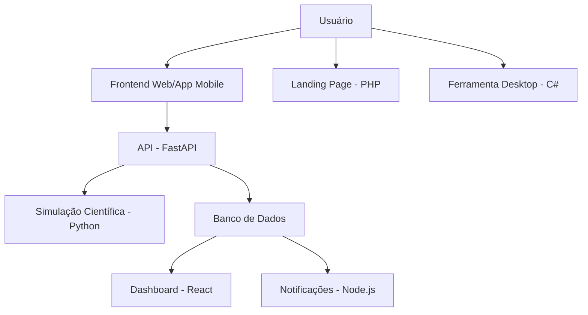

## Simulador de Experimentos Científicos Virtuais

Plataforma interativa para explorar princípios científicos por meio de simulações em **Física**, **Química** e **Matemática**. Experimente, visualize e compreenda fenômenos com recursos dinâmicos e explicações teóricas. Manipule variáveis relevantes, observe resultados em tempo real e desenvolva uma compreensão prática dos conceitos científicos.

Além disso, este projeto é também uma jornada pessoal de aprendizado. Ao utilizar diferentes linguagens de programação, frameworks e tecnologias, busco aprofundar meu conhecimento prático e conceitual sobre diversas soluções existentes no ecossistema de desenvolvimento — do backend ao frontend, passando por infraestrutura e mobile.

### Objetivo

Criar uma ferramenta educacional acessível e moderna que permita aos usuários compreenderem conceitos fundamentais de Física e Química por meio de simulações visuais e interações práticas, com suporte teórico baseado em Matemática.

- **Física**: Simulações de leis e fenômenos físicos com visualização de fórmulas e variáveis.
- **Química**: Reações e propriedades químicas com manipulação de parâmetros.
- **Matemática**: Fundamentos que explicam os conceitos físicos e químicos, com foco em fórmulas, grandezas e aplicações.

Cada experimento será apresentado em dois níveis:

- **Simplificado**: Modelos ideais com abstrações para facilitar a compreensão.
- **Realista**: Representações mais próximas da prática, com variáveis naturais e fenômenos complexos.

### Exemplos de Experimentos Iniciais

#### Física

1. Queda Livre e Gravidade
2. Leis de Newton (Movimento Retilíneo)
3. Circuito Elétrico Básico

#### Química

1. Reações Ácido-Base
2. Lei da Conservação da Massa
3. Estados Físicos da Matéria e Mudanças de Estado

### Arquitetura do Sistema

O sistema é modular e organizado para refletir o uso de diferentes tecnologias.

#### Módulos Principais

| Módulo | Tecnologia | Função |
| ------ | ---------- | ------ |
| `frontend-svelte` | Svelte + TypeScript | Interface principal do simulador |
| `backend-fastapi` | FastAPI + Python | API central |
| `simulation-python` | Python (NumPy/SciPy) | Módulo de simulações científicas |
| `mobile-flutter` | Flutter | Aplicativo mobile |
| `tools-csharp` | C# | Ferramenta desktop offline |

#### Módulos Complementares

| Módulo | Tecnologia | Função |
| ------ | ---------- | ------ |
| `frontend-react-dashboard` | React + Node.js | Dashboard de progresso |
| `backend-node-notify` | Node.js + Firebase | Notificações push e e-mail |
| `landing-php` | PHP + MySQL | Página de apoio e sugestões |

#### Infraestrutura

- Orquestração: `Docker Compose`
- CI/CD: `.github` (GitHub Actions)

#### Diagrama da Solução



#### Estrutura de Pastas

```
simulador-cientifico/
├── frontend-svelte/
├── frontend-react-dashboard/
├── backend-fastapi/
├── simulation-python/
├── backend-node-notify/
├── backend-java-admin/
├── landing-php/
├── mobile-flutter/
├── tools-csharp/
├── docker/
├── docs/
├── .github/
└── README.md
```

#### Roadmap

| Etapa | Descrição |
|-------|---------- |
| MVP | Simulador com 3 experimentos físicos/químicos |
| v1.0 | Integração completa entre módulos |
| v2.0 | Expansão de experimentos e internacionalização |

#### Testes Automatizados

Cobertura planejada para:

- API (FastAPI)
- Simulações (Python)
- Frontend (Svelte/React)
- Mobile (Flutter)

### Acessibilidade

- Suporte a leitores de tela
- Contraste adequado
- Navegação por teclado

### Página de Apoio

Acesse a Landing Page para:

- Apoiar o projeto
- Sugerir novos experimentos
- Contribuir tecnicamente ou financeiramente